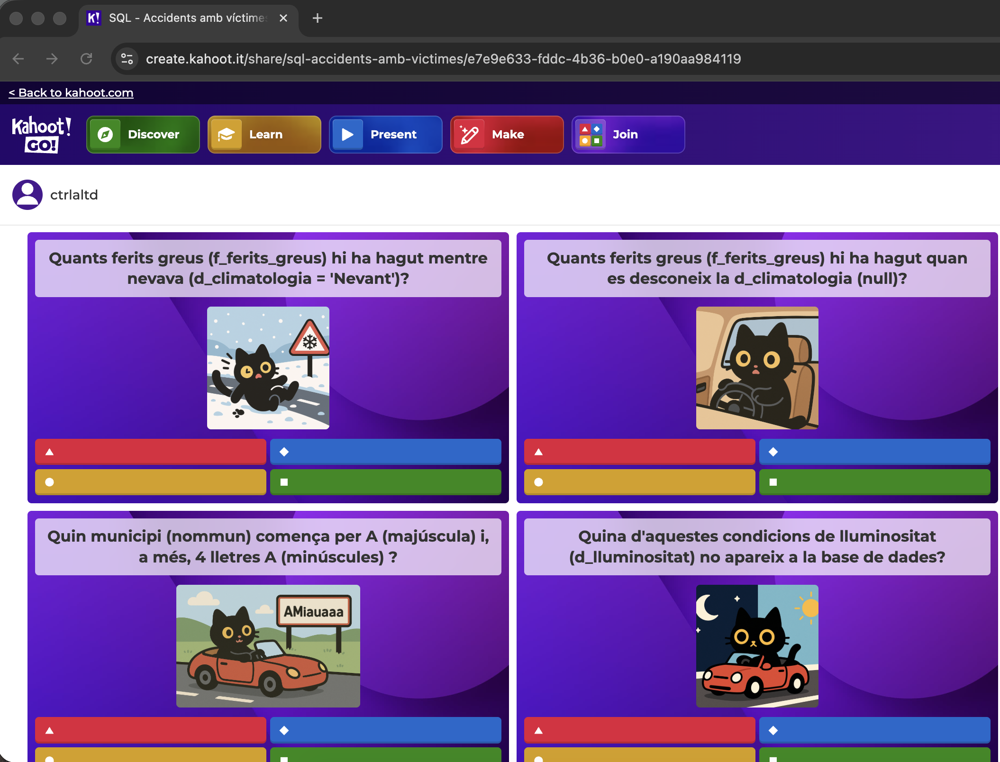

# Accidents Amb Víctimes

## Descripció


[Cat] Dataset d'[accidents de trànsit amb víctimes a Catalunya](https://analisi.transparenciacatalunya.cat/Transport/Accidents-de-tr-nsit-amb-morts-o-ferits-greus-a-Ca/rmgc-ncpb/about_data) carregat a una base de dades (Postgres, MySql o MSSqlServer) amb objectius acadèmics. Permet treballar les consules sql (projecció, selecció, agregats, funcions amb dates, etc). Totes les dades són a una sola taula. Disponible [Kahoot](#kahoot).

[Eng] Dataset of [traffic accidents with victims in Catalonia](https://analisi.transparenciacatalunya.cat/Transport/Accidents-de-tr-nsit-amb-morts-o-ferits-greus-a-Ca/rmgc-ncpb/about_data) loaded into a database (Postgres, MySQL or SQL Server) for academic purposes. Allows working with SQL queries (projection, selection, aggregates, date functions, etc). All data is in a single table. [Kahoot](#kahoot) available.

<br clear="left"/>

<details>
<summary>Pot ser que hi hagi un dataset nou publicat a Dades Obertes?</summary>
La darrera versió de les dades es pot descarregar des de:

👉 [Accidents de trànsit amb morts o ferits greus a Catalunya (Dades Obertes)](https://analisi.transparenciacatalunya.cat/Transport/Accidents-de-tr-nsit-amb-morts-o-ferits-greus-a-Ca/rmgc-ncpb/about_data)

Descarrega el fitxer CSV i col·loca'l a la carpeta `Data/` si vols actualitzar les dades.

</details>

---

## Com engegar l'entorn

Aquest projecte suporta **PostgreSQL**, **MySQL** i **SQL Server** (Azure SQL Edge). Pots seleccionar el gestor de base de dades que vulguis utilitzar mitjançant profiles de Docker Compose.

### Prerequisits

- **[Docker](https://www.docker.com/)** instal·lat i en funcionament

### Engegar l'entorn amb la base de dades que vulguis

```bash
# PostgreSQL
docker compose --profile postgres up --build

# MySQL
docker compose --profile mysql up --build

# SQL Server (Azure SQL Edge)
docker compose --profile sqlserver up --build
```

### Aturar i netejar l'entorn

```bash
# Aturar contenidors
docker compose down

# Eliminar contenidors i dades persistents
docker compose down -v
```

---

## Connexió a la base de dades des de DBeaver

### PostgreSQL

- **Host:** `localhost`
- **Port:** `5432`
- **Usuari:** `postgres`
- **Contrasenya:** `123456`
- **Base de dades:** `victimes`

### MySQL

- **Host:** `localhost`
- **Port:** `3306`
- **Usuari:** `root`
- **Contrasenya:** `123456`
- **Base de dades:** `victimes`

### SQL Server (Azure SQL Edge)

- **Host:** `localhost`
- **Port:** `1433`
- **Usuari:** `sa`
- **Contrasenya:** `Str0ngPass!`
- **Base de dades:** `victimes`

Fes clic a "Test Connection" per comprovar que tot funciona. Ara pots explorar i consultar les dades importades!

---

## Diccionari de dades

La base de dades conté informació detallada sobre accidents de trànsit amb víctimes a Catalunya. A continuació es descriu cada camp:

### Informació bàsica de l'accident

| Camp | Descripció | Description | Tipus |
|------|------------|-------------|-------|
| `any` | Any de l'accident | Year of the accident | Nombre |
| `dat` | Data de l'accident | Date of the accident | Data/hora |
| `zona` | Tipus de zona on s'ha produït l'accident (Zona urbana, Carretera) | Type of zone where the accident occurred (Urban area, Road) | Text |
| `via` | Tipus de via on s'ha produït l'accident | Type of road where the accident occurred | Text |
| `pk` | Punt quilomètric on s'ha produït l'accident | Kilometer point where the accident occurred | Decimal (nullable) |

### Ubicació

| Camp | Descripció | Description | Tipus |
|------|------------|-------------|-------|
| `nommun` | Municipi on s'ha produït l'accident | Municipality where the accident occurred | Text |
| `nomcom` | Comarca on s'ha produït l'accident | County where the accident occurred | Text |
| `nomdem` | Demarcació on s'ha produït l'accident | Region where the accident occurred | Text |

### Víctimes i vehicles implicats

| Camp | Descripció | Description | Tipus |
|------|------------|-------------|-------|
| `f_morts` | Nombre de morts en l'accident | Number of deaths in the accident | Nombre |
| `f_ferits_greus` | Nombre de ferits greus en l'accident | Number of seriously injured in the accident | Nombre |
| `f_ferits_lleus` | Nombre de ferits lleus en l'accident | Number of minor injuries in the accident | Nombre |
| `f_victimes` | Nombre total de víctimes en l'accident | Total number of victims in the accident | Nombre |
| `f_unitats_implicades` | Nombre de vehicles implicats | Number of vehicles involved | Nombre |
| `f_vianants_implicades` | Nombre de vianants implicats a l'accident | Number of pedestrians involved in the accident | Nombre |
| `f_bicicletes_implicades` | Nombre de bicicletes implicades a l'accident | Number of bicycles involved in the accident | Nombre |
| `f_ciclomotors_implicades` | Nombre de ciclomotors implicats a l'accident | Number of mopeds involved in the accident | Nombre |
| `f_motocicletes_implicades` | Nombre de motocicletes implicades a l'accident | Number of motorcycles involved in the accident | Nombre |
| `f_veh_lleugers_implicades` | Nombre de vehicles lleugers implicats a l'accident | Number of light vehicles involved in the accident | Nombre |
| `f_veh_pesants_implicades` | Nombre de vehicles pesants implicats a l'accident | Number of heavy vehicles involved in the accident | Nombre |
| `f_altres_unit_implicades` | Nombre d'altres tipus d'unitats implicades a l'accident | Number of other types of units involved in the accident | Nombre |
| `f_unit_desc_implicades` | Nombre d'unitats de tipus desconegut implicades a l'accident | Number of units of unknown type involved in the accident | Nombre |

### Característiques de la via i l'entorn

| Camp | Descripció | Description | Tipus |
|------|------------|-------------|-------|
| `c_velocitat_via` | Velocitat permesa a la via | Speed limit on the road | Nombre (nullable) |
| `d_caract_entorn` | Característiques del terreny | Terrain characteristics | Text |
| `d_carril_especial` | Existència de carril especial | Existence of special lane | Text |
| `d_circulacio_mesures_esp` | Mesures especials de circulació | Special traffic measures | Text |
| `d_func_esp_via` | Via amb funció especial | Road with special function | Text |
| `d_inter_seccio` | Accident produït en intersecció | Accident occurred at intersection | Text |
| `d_limit_velocitat` | Visualització del límit de velocitat de la via | Visibility of the road's speed limit | Text |
| `d_regulacio_prioritat` | Regulació de la prioritat a la via | Priority regulation on the road | Text |
| `d_sentits_via` | Sentits de la via | Road directions | Text |
| `d_subtipus_tram` | Classificació del tipus de tram | Classification of the road section type | Text |
| `d_subzona` | Classificació de la zona on s'ha produït l'accident | Classification of the zone where the accident occurred | Text |
| `d_superficie` | Estat de la calçada | Road surface condition | Text |
| `d_tipus_via` | Tipus de via | Type of road | Text |
| `d_titularitat_via` | Titularitat de la via | Road ownership | Text |
| `d_tracat_altimetric` | Classificació del traçat altimètric | Classification of the altimetric layout | Text |

### Condicions meteorològiques i ambientals

| Camp | Descripció | Description | Tipus |
|------|------------|-------------|-------|
| `d_boira` | Presència de boira | Presence of fog | Text |
| `d_climatologia` | Característiques de la climatologia | Weather characteristics | Text |
| `d_lluminositat` | Condicions de lluminositat en el moment de l'accident | Lighting conditions at the time of the accident | Text |
| `d_vent` | Classificació del vent | Wind classification | Text |

### Factors d'influència

| Camp | Descripció | Description | Tipus |
|------|------------|-------------|-------|
| `d_influit_boira` | Accident influït per la presència de boira | Accident influenced by the presence of fog | Text |
| `d_influit_caract_entorn` | Accident influït per les característiques del terreny | Accident influenced by terrain characteristics | Text |
| `d_influit_circulacio` | Accident influït per la circulació | Accident influenced by traffic | Text |
| `d_influit_estat_clima` | Accident influït per l'estat del temps | Accident influenced by weather conditions | Text |
| `d_influit_inten_vent` | Accident influït per la presència de vent | Accident influenced by the presence of wind | Text |
| `d_influit_lluminositat` | Accident influït per lluminositat | Accident influenced by lighting | Text |
| `d_influit_mesu_esp` | Accident influït per mesures especials de circulació | Accident influenced by special traffic measures | Text |
| `d_influit_obj_calcada` | Accident influït per presència d'objecte en calçada | Accident influenced by presence of object on road | Text |
| `d_influit_solcs_rases` | Accident influït per presència de solcs o rases | Accident influenced by presence of ruts or grooves | Text |
| `d_influit_visibilitat` | Accident influït per manca de visibilitat | Accident influenced by lack of visibility | Text |

### Classificació de l'accident

| Camp | Descripció | Description | Tipus |
|------|------------|-------------|-------|
| `d_gravetat` | Gravetat de l'accident | Severity of the accident | Text |
| `d_subtipus_accident` | Classificació de l'accident | Classification of the accident | Text |
| `d_acc_amb_fuga` | Accident amb fuga | Hit-and-run accident | Text |
| `tipacc` | Tipus d'accident | Type of accident | Text |

### Informació temporal

| Camp | Descripció | Description | Tipus |
|------|------------|-------------|-------|
| `hor` | Hora en què s'ha produït l'accident | Time when the accident occurred | Text |
| `gruphor` | Franja del dia en què s'ha produït l'accident | Time period of the day when the accident occurred | Text |
| `grupdialab` | Dia laborable o feiner | Working day or weekday | Text |
| `tipdia` | Dia de la setmana en què s'ha produït l'accident | Day of the week when the accident occurred | Text |

---

### Kahoot

[Kahoot - SQL - Accidents amb víctimes](https://create.kahoot.it/share/sql-accidents-amb-victimes/e7e9e633-fddc-4b36-b0e0-a190aa984119)



### Anàlisi de dades

Ara que ja tens carregades les dades, prepara amb els companys alguna consulta sobre les dades, per exemple, després de llegir aquesta notícia:


Buquem quin va ser el punt quilomètric exacte i també si al voltant d'aquell punt kilomètric hi ha hagut altres accidents:


<details>

<summary>Consulta i resultat</summary>
```sql
SELECT Sum(f_morts)    AS morts,
       Sum(f_victimes) AS victimes,
       pk              AS "Punt quilomètric"
FROM   accidents
WHERE  via = 'AP-7'
       AND pk BETWEEN 320 AND 340
GROUP  BY via,
          pk
ORDER  BY 1 DESC,
          2 DESC 
```

**Resultats:**

| Morts | Víctimes | Punt quilomètric |
|-------|----------|------------------|
| 13 | 49 | 333.2 |
| 1 | 10 | 328.1 |
| 1 | 2 | 332.6 |
| 1 | 2 | 321 |
| 1 | 1 | 336.8 |
| 1 | 1 | 336.7 |
| 1 | 1 | 324.5 |
| 1 | 1 | 334.3 |
| 0 | 17 | 330 |
| 0 | 10 | 325 |
| 0 | 5 | 328 |
| 0 | 4 | 332.5 |
| 0 | 2 | 320.2 |
| 0 | 2 | 322.9 |
| 0 | 2 | 332.2 |
| 0 | 2 | 337 |
| 0 | 1 | 330.8 |
| 0 | 1 | 336.5 |
| 0 | 1 | 323 |
| 0 | 1 | 322.3 |
| 0 | 1 | 332.4 |

</details>

---

### Autor

Projecte creat per [ctrl-alt-d](https://github.com/ctrl-alt-d)
