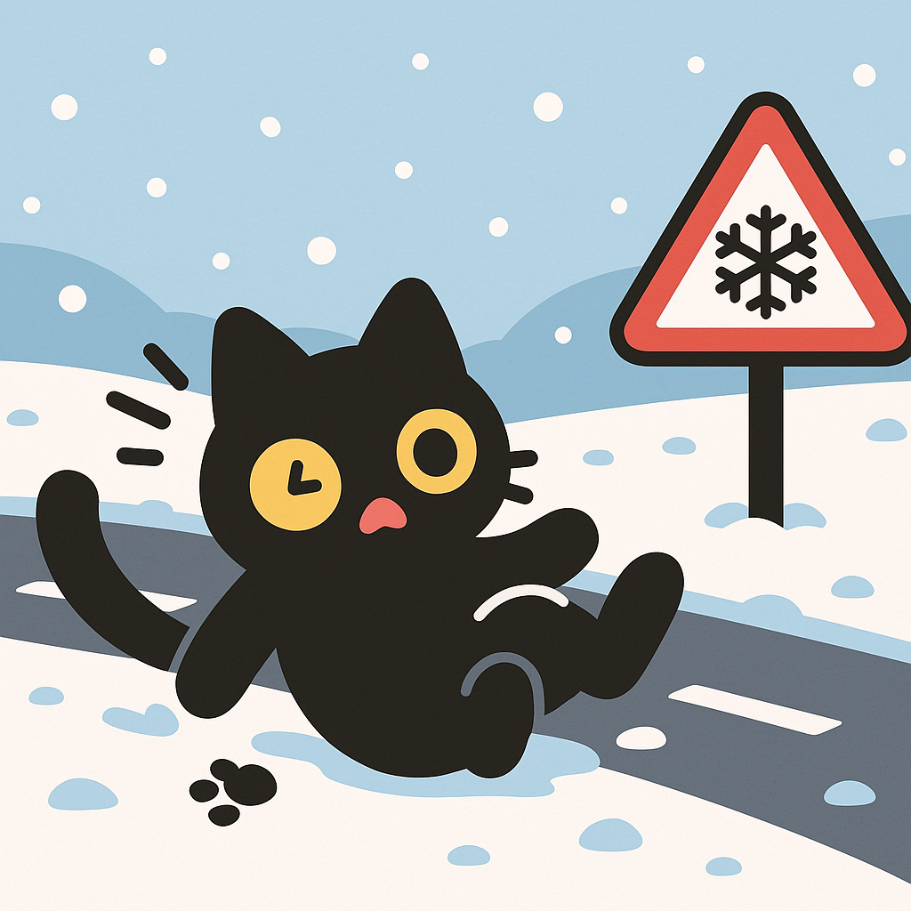
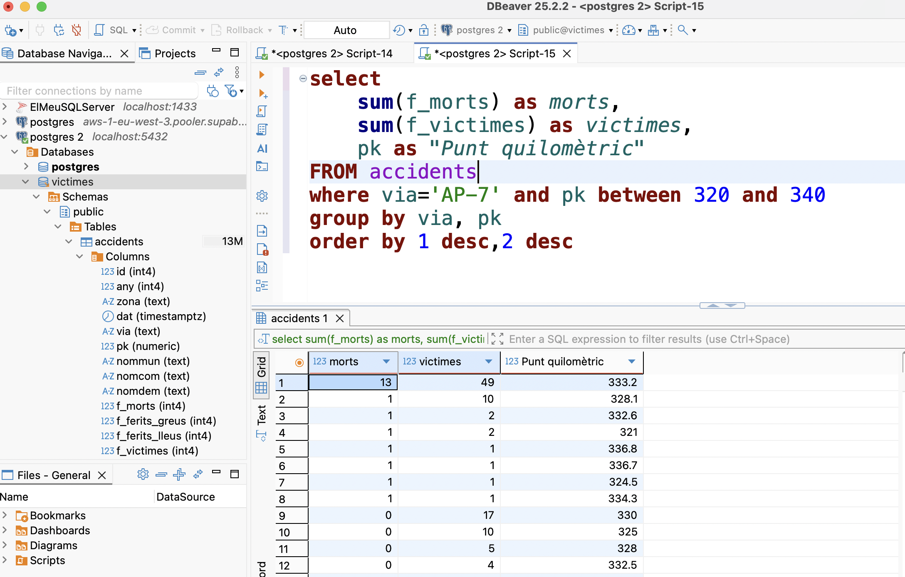

# AccidentsAmbVictimes

## Descripció

Projecte per importar i analitzar dades d'accidents de trànsit amb víctimes a Catalunya.



La darrera versió de les dades es pot descarregar des de:

👉 [Accidents de trànsit amb morts o ferits greus a Catalunya (Dades Obertes)](https://analisi.transparenciacatalunya.cat/Transport/Accidents-de-tr-nsit-amb-morts-o-ferits-greus-a-Ca/rmgc-ncpb/about_data)

Descarrega el fitxer CSV i col·loca'l a la carpeta `Data/` si vols actualitzar les dades.

---

## Com engegar l'entorn

1. **Assegura't de tenir [Docker](https://www.docker.com/) instal·lat.**
2. Obre un terminal a la carpeta del projecte i executa:

```sh
docker-compose up
```

>Això posarà en marxa:
>- Una base de dades PostgreSQL (usuari: `postgres`, contrasenya: `123456`, port: `5432`)
>- Un contenidor que importa les dades al PostgreSQL

3. Pots aturar l'entorn amb `Ctrl+C` i, si vols eliminar els contenidors i dades, executa:

```sh
docker-compose down -v
```

---

## Connexió a la base de dades des de DBeaver

1. Obre DBeaver i crea una nova connexió PostgreSQL.
2. Paràmetres de connexió:
	- **Host:** `localhost`
	- **Port:** `5432`
	- **Usuari:** `postgres`
	- **Contrasenya:** `123456`
	- **Base de dades:** `victimes`
3. Fes clic a "Test Connection" per comprovar que tot funciona.

Ara pots explorar i consultar les dades importades!

---

### Anàlisi de dades

Ara que ja tens carregades les dades, prepara amb els companys alguna consulta sobre les dades, per exemple, després de llegir aquesta notícia:


Buquem quin va ser el punt quilomètric exacte i també si al voltant d'aquell punt kilomètric hi ha hagut altres accidents:



<details>

<summary>Consulta i resultat</summary>
```sql
select
	sum(f_morts) as morts,
	sum(f_victimes) as victimes,
	pk as "Punt quilomètric"
FROM accidents
where via='AP-7' and pk between 320 and 340
group by via, pk
order by 1 desc,2 desc
```

**Resultats:**

| Morts | Víctimes | Punt quilomètric |
|-------|----------|------------------|
| 13 | 49 | 333.2 |
| 1 | 10 | 328.1 |
| 1 | 2 | 332.6 |
| 1 | 2 | 321 |
| 1 | 1 | 336.8 |
| 1 | 1 | 336.7 |
| 1 | 1 | 324.5 |
| 1 | 1 | 334.3 |
| 0 | 17 | 330 |
| 0 | 10 | 325 |
| 0 | 5 | 328 |
| 0 | 4 | 332.5 |
| 0 | 2 | 320.2 |
| 0 | 2 | 322.9 |
| 0 | 2 | 332.2 |
| 0 | 2 | 337 |
| 0 | 1 | 330.8 |
| 0 | 1 | 336.5 |
| 0 | 1 | 323 |
| 0 | 1 | 322.3 |
| 0 | 1 | 332.4 |

</details>

---

## Diccionari de dades

La base de dades conté informació detallada sobre accidents de trànsit amb víctimes a Catalunya. A continuació es descriu cada camp:

### Informació bàsica de l'accident

| Camp | Descripció | Tipus |
|------|------------|-------|
| `any` | Any de l'accident | Nombre |
| `dat` | Data de l'accident | Data/hora |
| `zona` | Tipus de zona on s'ha produït l'accident (Zona urbana, Carretera) | Text |
| `via` | Tipus de via on s'ha produït l'accident | Text |
| `pk` | Punt quilomètric on s'ha produït l'accident | Decimal (nullable) |

### Ubicació

| Camp | Descripció | Tipus |
|------|------------|-------|
| `nommun` | Municipi on s'ha produït l'accident | Text |
| `nomcom` | Comarca on s'ha produït l'accident | Text |
| `nomdem` | Demarcació on s'ha produït l'accident | Text |

### Víctimes i vehicles implicats

| Camp | Descripció | Tipus |
|------|------------|-------|
| `f_morts` | Nombre de morts en l'accident | Nombre |
| `f_ferits_greus` | Nombre de ferits greus en l'accident | Nombre |
| `f_ferits_lleus` | Nombre de ferits lleus en l'accident | Nombre |
| `f_victimes` | Nombre total de víctimes en l'accident | Nombre |
| `f_unitats_implicades` | Nombre de vehicles implicats | Nombre |
| `f_vianants_implicades` | Nombre de vianants implicats a l'accident | Nombre |
| `f_bicicletes_implicades` | Nombre de bicicletes implicades a l'accident | Nombre |
| `f_ciclomotors_implicades` | Nombre de ciclomotors implicats a l'accident | Nombre |
| `f_motocicletes_implicades` | Nombre de motocicletes implicades a l'accident | Nombre |
| `f_veh_lleugers_implicades` | Nombre de vehicles lleugers implicats a l'accident | Nombre |
| `f_veh_pesants_implicades` | Nombre de vehicles pesants implicats a l'accident | Nombre |
| `f_altres_unit_implicades` | Nombre d'altres tipus d'unitats implicades a l'accident | Nombre |
| `f_unit_desc_implicades` | Nombre d'unitats de tipus desconegut implicades a l'accident | Nombre |

### Característiques de la via i l'entorn

| Camp | Descripció | Tipus |
|------|------------|-------|
| `c_velocitat_via` | Velocitat permesa a la via | Nombre (nullable) |
| `d_caract_entorn` | Característiques del terreny | Text |
| `d_carril_especial` | Existència de carril especial | Text |
| `d_circulacio_mesures_esp` | Mesures especials de circulació | Text |
| `d_func_esp_via` | Via amb funció especial | Text |
| `d_inter_seccio` | Accident produït en intersecció | Text |
| `d_limit_velocitat` | Visualització del límit de velocitat de la via | Text |
| `d_regulacio_prioritat` | Regulació de la prioritat a la via | Text |
| `d_sentits_via` | Sentits de la via | Text |
| `d_subtipus_tram` | Classificació del tipus de tram | Text |
| `d_subzona` | Classificació de la zona on s'ha produït l'accident | Text |
| `d_superficie` | Estat de la calçada | Text |
| `d_tipus_via` | Tipus de via | Text |
| `d_titularitat_via` | Titularitat de la via | Text |
| `d_tracat_altimetric` | Classificació del traçat altimètric | Text |

### Condicions meteorològiques i ambientals

| Camp | Descripció | Tipus |
|------|------------|-------|
| `d_boira` | Presència de boira | Text |
| `d_climatologia` | Característiques de la climatologia | Text |
| `d_lluminositat` | Condicions de lluminositat en el moment de l'accident | Text |
| `d_vent` | Classificació del vent | Text |

### Factors d'influència

| Camp | Descripció | Tipus |
|------|------------|-------|
| `d_influit_boira` | Accident influït per la presència de boira | Text |
| `d_influit_caract_entorn` | Accident influït per les característiques del terreny | Text |
| `d_influit_circulacio` | Accident influït per la circulació | Text |
| `d_influit_estat_clima` | Accident influït per l'estat del temps | Text |
| `d_influit_inten_vent` | Accident influït per la presència de vent | Text |
| `d_influit_lluminositat` | Accident influït per lluminositat | Text |
| `d_influit_mesu_esp` | Accident influït per mesures especials de circulació | Text |
| `d_influit_obj_calcada` | Accident influït per presència d'objecte en calçada | Text |
| `d_influit_solcs_rases` | Accident influït per presència de solcs o rases | Text |
| `d_influit_visibilitat` | Accident influït per manca de visibilitat | Text |

### Classificació de l'accident

| Camp | Descripció | Tipus |
|------|------------|-------|
| `d_gravetat` | Gravetat de l'accident | Text |
| `d_subtipus_accident` | Classificació de l'accident | Text |
| `d_acc_amb_fuga` | Accident amb fuga | Text |
| `tipacc` | Tipus d'accident | Text |

### Informació temporal

| Camp | Descripció | Tipus |
|------|------------|-------|
| `hor` | Hora en què s'ha produït l'accident | Text |
| `gruphor` | Franja del dia en què s'ha produït l'accident | Text |
| `grupdialab` | Dia laborable o feiner | Text |
| `tipdia` | Dia de la setmana en què s'ha produït l'accident | Text |


---

### Autor

Projecte creat per [ctrl-alt-d](https://github.com/ctrl-alt-d)
